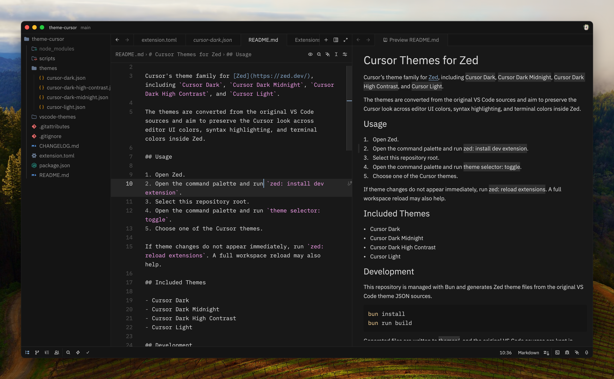
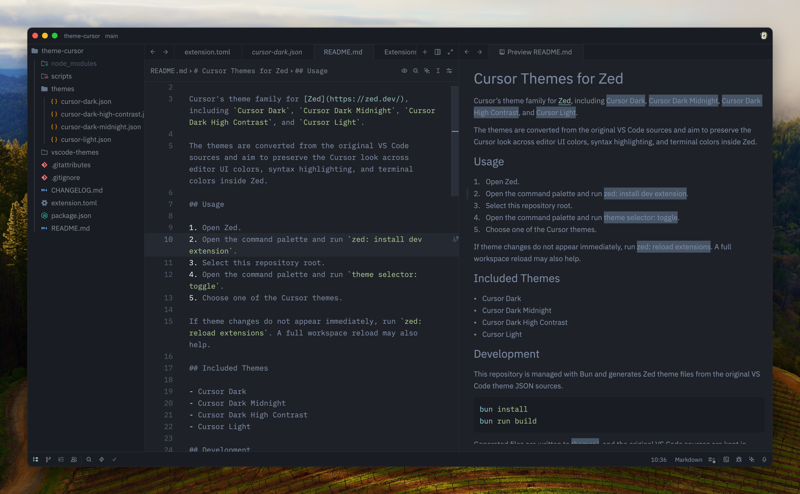
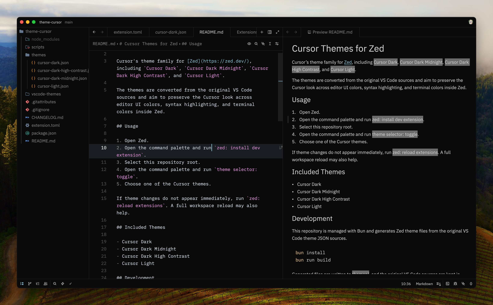
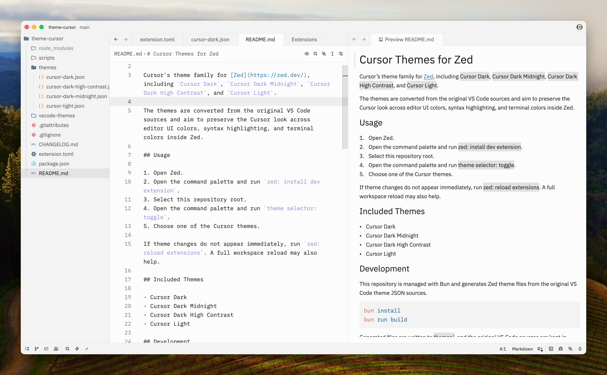

# Cursor Themes for Zed

Cursor's theme family for [Zed](https://zed.dev/), including `Cursor Dark`, `Cursor Dark Midnight`, `Cursor Dark High Contrast`, and `Cursor Light`.

The themes are converted from the original VS Code sources and aim to preserve the Cursor look across editor UI colors, syntax highlighting, and terminal colors inside Zed.

## Usage

1. Open Zed.
2. Open the command palette and run `zed: install dev extension`.
3. Select this repository root.
4. Open the command palette and run `theme selector: toggle`.
5. Choose one of the Cursor themes.

If theme changes do not appear immediately, run `zed: reload extensions`. A full workspace reload may also help.

## Previews

| Cursor Dark | Cursor Dark Midnight |
| --- | --- |
|  |  |

| Cursor Dark High Contrast | Cursor Light |
| --- | --- |
|  |  |

## Development

This repository is managed with Bun and generates Zed theme files from the original VS Code theme JSON sources.

```sh
bun install
bun run build
```

Generated files are written to [`themes/`](./themes), and the original VS Code sources are kept in [`vscode-themes/`](./vscode-themes).

## Project Layout

```text
extension.toml              # Zed extension manifest
package.json                # Bun scripts and local project metadata
scripts/convert-vscode-to-zed.mjs
themes/*.json               # Generated Zed theme files
vscode-themes/*.json        # Original VS Code theme sources
```

The converter follows Zed's official VS Code importer mapping for:

- UI color slots
- syntax token scope matching
- font style and bold/italic conversion

## Notes

- Zed themes use `themes/*.json` plus `extension.toml`; `package.json` is only used for local Bun scripts.
- Zed does not have a separate high-contrast appearance type, so `Cursor Dark High Contrast` is exported as a dark theme.
- This repository currently targets local development as a Zed dev extension.
